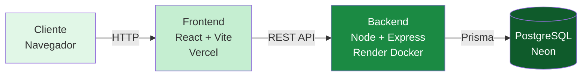
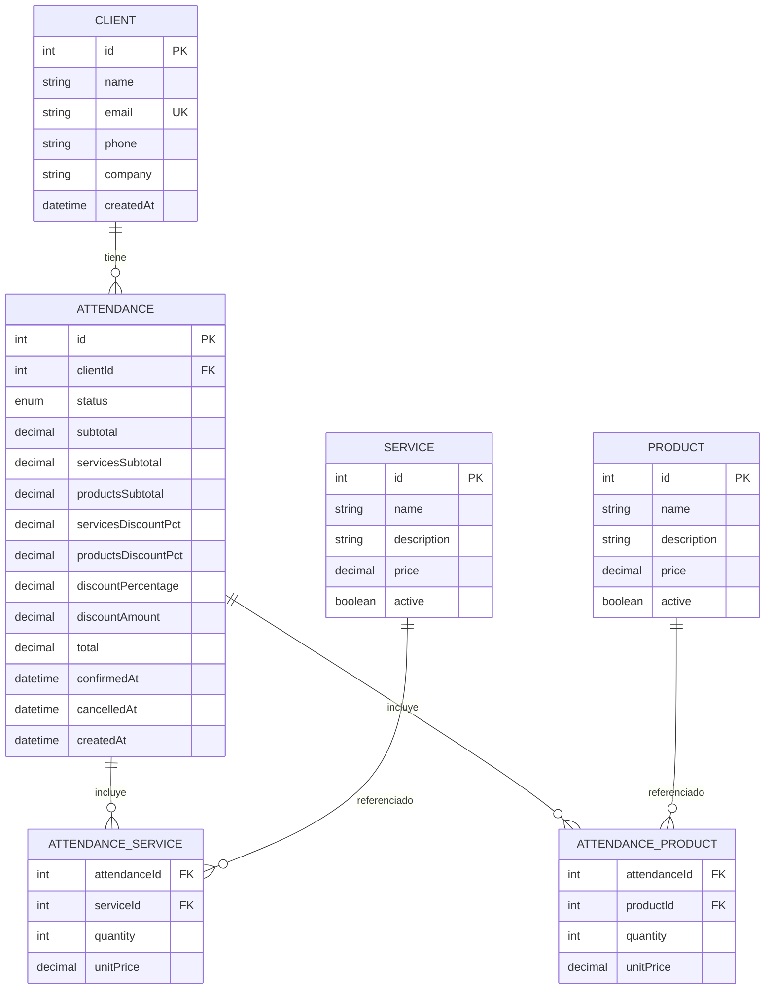
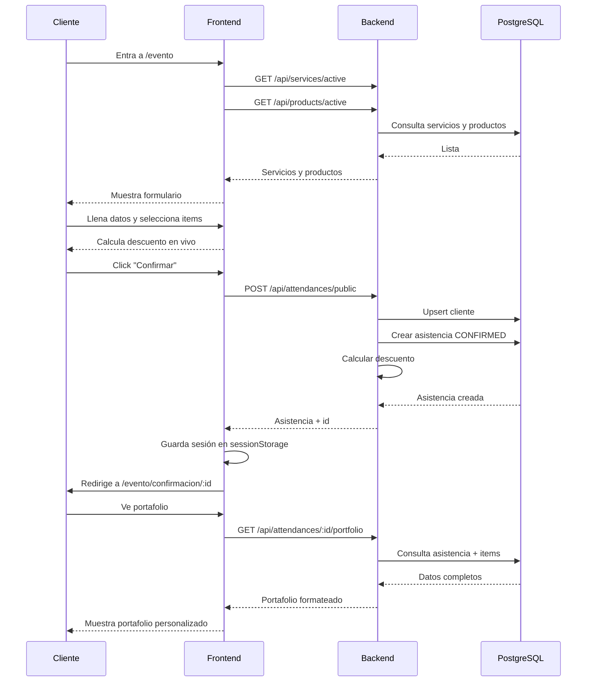

# DISAGRO Event Platform

Plataforma para confirmar asistencia al evento anual de DISAGRO y armar un portafolio personalizado con descuentos según los servicios y productos seleccionados.

##  Links de producción

| Recurso | URL |
|---|---|
| **Plataforma pública** | https://disagro-event-platform.vercel.app/evento |
| **Panel admin** | https://disagro-event-platform.vercel.app |
| **Backend API** | https://disagro-event-platform-backend.onrender.com |
| **Health check** | https://disagro-event-platform-backend.onrender.com/api/health |
| **Repositorio** | https://github.com/kanuso/disagro-event-platform |

>  **Nota**: El backend en Render usa el plan Free, que duerme el servicio después de 15 minutos de inactividad. La primera request puede tardar ~30 segundos en responder.

---

##  Descripción

La plataforma permite a los clientes:

1. **Confirmar su asistencia** al evento anual
2. **Seleccionar servicios y productos** de su interés
3. **Ver el descuento aplicado en tiempo real**
4. **Recibir un portafolio personalizado** con el desglose

Además incluye un **panel administrativo** para que el equipo de ventas consulte las asistencias y gestione su estado.

---

##  Arquitectura



### Componentes

| Componente | Tecnología | Hosting |
|---|---|---|
| **Frontend** | React + Vite + TypeScript + Tailwind | Vercel |
| **Backend** | Node + Express + TypeScript + Prisma | Render (Docker) |
| **Base de datos** | PostgreSQL 16 | Neon (serverless) |
| **Desarrollo local** | Docker Compose | Local |

---

##  Modelo de datos



---

##  Flujo del cliente



---

##  Stack tecnológico

### Backend
- **Node.js 20** + **TypeScript**
- **Express** (servidor HTTP)
- **Prisma ORM** (acceso a datos)
- **PostgreSQL 16** (base de datos)
- **Zod** (validación de schemas)
- **JWT** + **bcrypt** (autenticación, preparado)
- **Helmet** + **CORS** (seguridad)
- **Docker** (containerización)

### Frontend
- **React 18** + **TypeScript**
- **Vite** (build tool)
- **React Router v6** (routing)
- **Tailwind CSS** (estilos)
- **Axios** (HTTP client)
- **Lucide React** (iconografía)

### DevOps
- **Docker Compose** (desarrollo local)
- **Render** (backend en producción)
- **Vercel** (frontend en producción)
- **Neon** (PostgreSQL en producción)

---

##  Funcionalidades

### Flujo público (cliente)

- ✅ Formulario de confirmación en `/evento`
- ✅ Selección de servicios con cantidades
- ✅ Selección de productos con cantidades
- ✅ Cálculo del descuento en tiempo real
- ✅ Generación del portafolio personalizado
- ✅ Consulta posterior en `/evento/confirmacion/:id`
- ✅ Sesión del cliente con expiración de 24h

### Panel administrativo

- ✅ Dashboard con KPIs en tiempo real
- ✅ Listado de asistencias con filtros por estado
- ✅ Búsqueda por cliente o ID
- ✅ Confirmar / cancelar asistencias
- ✅ Detalle de cada asistencia

### Reglas de descuento

**Servicios:**
| Condición | Descuento |
|---|---|
| 2 o más servicios | 3% |
| 2 o más servicios y subtotal > Q1,500 | 5% |

**Productos:**
| Condición | Descuento |
|---|---|
| 3 o más productos | 3% |
| 5 o más productos | 5% |

**Total**: los porcentajes se **acumulan** (ej: 5% servicios + 3% productos = 8% total).

**Interpretación**: "2 o más servicios" significa **servicios distintos**. Si un cliente pide 3 unidades del mismo servicio, cuenta como 1 servicio para el descuento.

---

##  Cómo correr localmente

### Requisitos
- Docker Desktop instalado
- Git

### Con Docker (recomendado)

```bash
# 1. Clonar el repo
git clone https://github.com/kanuso/disagro-event-platform.git
cd disagro-event-platform

# 2. Levantar los 3 servicios
docker compose up --build

# 3. En otra terminal, aplicar migraciones y seed
docker exec -it disagro-backend npx prisma migrate deploy
docker exec -it disagro-backend npx prisma db seed
```

Acceder a:
- **Frontend**: http://localhost:8081
- **Formulario público**: http://localhost:8081/evento
- **Backend**: http://localhost:3000
- **Health check**: http://localhost:3000/api/health

### Sin Docker

**Backend:**
```bash
cd backend
npm install
cp .env.example .env  # configurar DATABASE_URL
npx prisma migrate dev
npx prisma db seed
npm run dev
```

**Frontend:**
```bash
cd frontend
npm install
npm run dev
```

---

##  Estructura del proyecto

```
disagro-event-platform/
├── backend/
│   ├── prisma/
│   │   ├── schema.prisma
│   │   ├── migrations/
│   │   └── seed.ts
│   ├── src/
│   │   ├── config/          # Configuración (Prisma client)
│   │   ├── controllers/     # Handlers HTTP
│   │   ├── middlewares/     # Auth, errores
│   │   ├── repositories/    # Acceso a datos
│   │   ├── routes/          # Rutas Express
│   │   ├── services/        # Lógica de negocio
│   │   ├── types/           # Tipos compartidos
│   │   └── validators/      # Schemas Zod
│   ├── Dockerfile
│   └── package.json
├── frontend/
│   ├── src/
│   │   ├── components/      # Componentes reutilizables
│   │   ├── pages/           # Pantallas
│   │   ├── services/        # Llamadas a la API
│   │   ├── types/           # Tipos TS
│   │   └── utils/           # Utilidades (descuento, sesión)
│   ├── Dockerfile
│   ├── nginx.conf
│   └── package.json
├── postman/
│   └── DISAGRO.postman_collection.json
├── docker-compose.yml
├── render.yaml
└── README.md
```

---

##  Endpoints de la API

### Públicos

| Método | Endpoint | Descripción |
|---|---|---|
| `POST` | `/api/attendances/public` | Confirmar asistencia (cliente) |
| `GET` | `/api/attendances/:id/portfolio` | Ver portafolio personalizado |
| `GET` | `/api/services/active` | Listar servicios activos |
| `GET` | `/api/products/active` | Listar productos activos |
| `GET` | `/api/health` | Health check |

### Admin (protegidos con JWT)

| Método | Endpoint | Descripción |
|---|---|---|
| `GET` | `/api/attendances` | Listar asistencias |
| `GET` | `/api/attendances/:id` | Ver asistencia por ID |
| `PATCH` | `/api/attendances/:id/confirm` | Confirmar asistencia |
| `PATCH` | `/api/attendances/:id/cancel` | Cancelar asistencia |
| `GET` | `/api/clients` | Listar clientes |
| `GET` | `/api/services` | Listar servicios |
| `GET` | `/api/products` | Listar productos |
| `GET` | `/api/reports/attendances` | Reporte de asistencias |
| `GET` | `/api/reports/products` | Reporte de productos |
| `GET` | `/api/reports/services` | Reporte de servicios |

**Colección Postman**: ver carpeta `postman/` en el repo.

---

##  Decisiones de diseño

### 1. Backend como fuente de verdad

El cálculo del descuento se realiza **en el backend**. El frontend solo lo previsualiza para dar feedback al usuario. Esto evita manipulación de precios desde el cliente.

### 2. Precios históricos

Al crear una asistencia se almacena el precio unitario de cada servicio y producto en ese momento (`unitPrice`). Si los precios cambian después, el portafolio histórico mantiene los valores originales.

### 3. Desglose de descuentos

Se almacenan por separado:
- `servicesSubtotal` y `productsSubtotal`
- `servicesDiscountPct` y `productsDiscountPct`
- `discountPercentage` (suma)
- `discountAmount` y `total`

Esto permite auditorías y reportes granulares.

### 4. Sesión del cliente

Se guarda en `sessionStorage` con expiración de 24h. Permite al cliente volver a ver su portafolio sin volver a llenar el formulario.

### 5. Docker multi-stage

Los Dockerfiles usan **multi-stage builds**:
- **Etapa 1 (builder)**: instala dependencias y compila TypeScript
- **Etapa 2 (runner)**: copia solo los artefactos necesarios

Esto reduce el tamaño de las imágenes finales.

### 6. Nginx para el frontend

El frontend compilado se sirve con **Nginx** en un contenedor Docker. El `nginx.conf` incluye la regla `try_files $uri $uri/ /index.html` para soportar las rutas de React Router.

---

##  Docker

El proyecto usa **3 servicios** con Docker Compose:

| Servicio | Imagen | Puerto | Descripción |
|---|---|---|---|
| `postgres` | `postgres:16-alpine` | 5432 | Base de datos |
| `backend` | Custom (Node 20) | 3000 | API Express |
| `frontend` | Custom (Nginx) | 8081 | React compilado |

Comandos útiles:

```bash
# Levantar todo
docker compose up --build

# Ver logs
docker compose logs -f backend

# Detener
docker compose down

# Detener y borrar la BD
docker compose down -v
```

---

##  Seed

El archivo `backend/prisma/seed.ts` carga:

- **5 servicios** (Mantenimiento, Capacitación, Análisis de Suelos, Asesoría Agronómica, Instalación de Riego)
- **7 productos** (Fertilizantes, Urea, Fungicidas, Herbicidas, Semillas, Bioestimulantes, Insecticidas)

Para correrlo:

```bash
npx prisma db seed
```

---

##  Plus: Manejo de sesión

Se implementó un mecanismo de sesión del cliente:

- Al confirmar asistencia se guarda en `sessionStorage` (clientId, nombre, email, totales)
- Expiración de 24 horas
- Función `getEventSession()` para leerla
- Función `clearEventSession()` para limpiarla

Además, el backend tiene la **estructura JWT lista** para extender a autenticación de operadores:
- `auth.middleware.ts` con `requireAuth`
- `bcrypt` + `jsonwebtoken` instalados
- Modelo `User` en el schema

---

##  Licencia

Este proyecto fue desarrollado como parte de una prueba técnica para DISAGRO.

---

## Autor

**Kenedy Palma**
- GitHub: [@kanuso](https://github.com/kanuso)